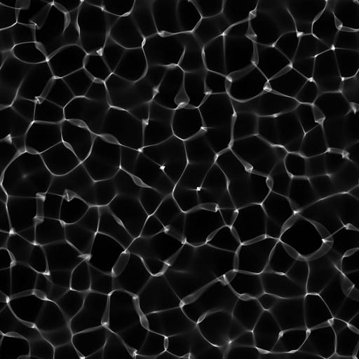
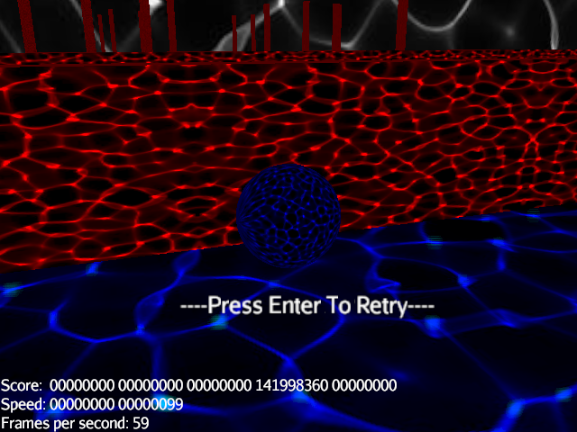
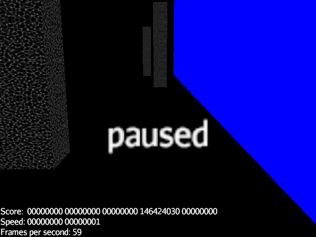
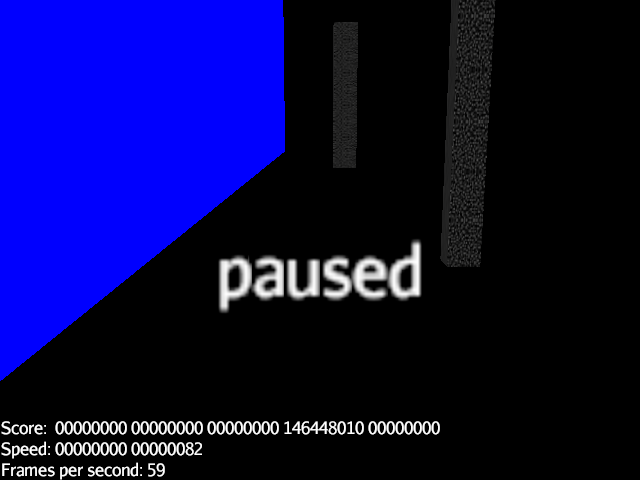
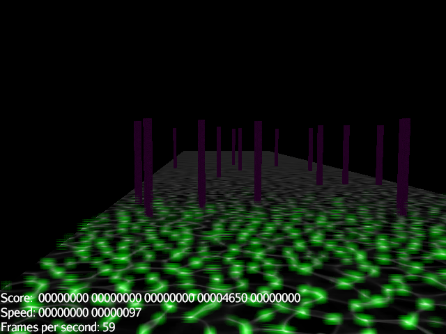

# **Game0001** -- The Ball Game 

[Game](#about-the-game "About the game") \
[Set up](#project-set-up "Project set up") \
[How to run](#how-to-run--for-development- "How to run (for development)")

***

***

## About the game

- A **endless** game,

***

- with many things,

***

- and many biomes,

***

- and an FPP like view also, for difficulty.

***

see this [video](ImageAndVideos/ScreenRecording.avi "wait it may load now")\

## Project set up
This is a gradle project using JMonkey Engine and other java libraries

## How to run (for development)
You'll want a java 11 JDK installed on your machine (Your IDE may do this for you, IntelliJ does)

Open this application in your preferred IDE (IntelliJ and Eclipse will support Gradle by default, netbeans will support it with a plugin). The remaining instructions are for IntelliJ but the basic principle will be the same for any IDE)

[#](#game0001----the-ball-game "Scroll to top")
